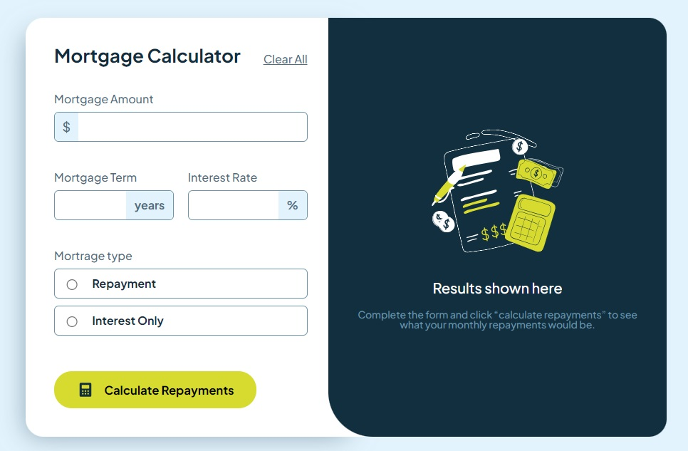

# Frontend Mentor - Mortgage repayment calculator solution

This is a solution to the [Mortgage repayment calculator challenge on Frontend Mentor](https://www.frontendmentor.io/challenges/mortgage-repayment-calculator-Galx1LXK73). Frontend Mentor challenges help you improve your coding skills by building realistic projects. 

## Table of contents

- [Overview](#overview)
  - [The challenge](#the-challenge)
  - [Screenshot](#screenshot)
  - [Links](#links)
- [My process](#my-process)
  - [Built with](#built-with)
  - [What I learned](#what-i-learned)
  - [Continued development](#continued-development)
  - [Useful resources](#useful-resources)
- [Author](#author)
- [Acknowledgments](#acknowledgments)

**Note: Delete this note and update the table of contents based on what sections you keep.**

## Overview

### The challenge

Users should be able to:

- Input mortgage information and see monthly repayment and total repayment amounts after submitting the form
- See form validation messages if any field is incomplete
- Complete the form only using their keyboard
- View the optimal layout for the interface depending on their device's screen size
- See hover and focus states for all interactive elements on the page

### Screenshot

### Links

- Solution URL: [GitHub](https://github.com/polinagusakova/Mortgage-calculator)
- Live Site URL: [GitHub pages](https://your-live-site-url.com)

## My process

### Built with

- Semantic HTML5 markup
- CSS custom properties
- Flexbox
- JavaScript
- Sass / SCSS

### What I learned

I learned how to work with HTML and CSS. How to submit form without reload the page. Sass and validation in JavaScript.

### Continued development

I want to continue practicing with responsible design and accessibility.

### Useful resources

- [MDN resources](https://developer.mozilla.org/en-US/) - This helped me for searching information and to found answers.
- [Stack Overflow](https://stackoverflow.com/) - This helped me to resolve problem with JS events.
- [W3Schools](https://www.w3schools.com/) - Learn to code.

## Author

- Website - [Polina](https://github.com/polinagusakova)